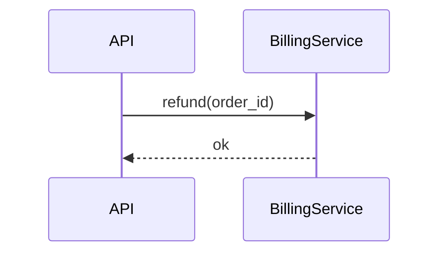
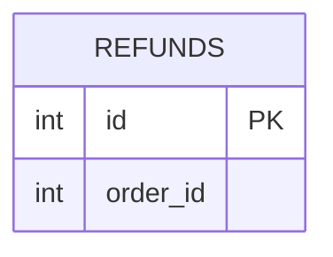

# doc-align Phase 1 Implementation Plan

> **For agentic workers:** REQUIRED SUB-SKILL: Use superpowers:subagent-driven-development (recommended) or superpowers:executing-plans to implement this plan task-by-task. Steps use checkbox (`- [ ]`) syntax for tracking.

**Goal:** 完成 doc-align 的核心：deterministic scripts、check/sync playbook、Claude Code adapter，讓單一 repo 可手動執行 drift 偵測與文件同步。

**Architecture:** LLM agent 是 orchestrator，照 markdown playbook 執行流程；所有機械工作（manifest 讀寫、git diff 範圍反查、schema 比對、Mermaid 檢查）由零依賴 Node.js scripts 處理，agent 用 bash 呼叫並讀取 JSON 輸出。playbook 與 scripts 不得出現任何 agent 專屬工具名稱。

**Tech Stack:** Node.js ≥ 18（ESM、內建 `node:test`），零 npm 依賴。Spec 見 `docs/superpowers/specs/2026-07-20-doc-align-design.md`。

**Not in this plan（後續 plan 處理）:** `init` 指令、opencode adapter、雙 agent 驗證、GitHub Action / PR 留言（spec Phase 2、3）。因此本計畫的 fixture repo 附帶預先寫好的文件與 manifest（不經 init 生成）。

---

### Task 1: 專案腳手架

**Files:**
- Create: `package.json`
- Create: `.gitignore`
- Create: `README.md`

- [ ] **Step 1: 建立 package.json**

```json
{
  "name": "doc-align",
  "private": true,
  "type": "module",
  "engines": { "node": ">=18" },
  "scripts": {
    "test": "node --test tests/"
  }
}
```

- [ ] **Step 2: 建立 .gitignore**

```
node_modules/
*.log
```

- [ ] **Step 3: 建立 README.md（先寫定位與結構，用法在 Task 14 補完）**

```markdown
# doc-align

讓 repo 內的輕量文件集（Mermaid 圖 + 短註）與程式碼保持對齊的工具。
工具只報告差異，由人決定文件過時還是程式碼有問題。

設計文件：docs/superpowers/specs/2026-07-20-doc-align-design.md

## 結構

- `playbook/` — 核心流程指令（agent 無關的 markdown）
- `scripts/` — deterministic Node.js scripts（零依賴）
- `adapters/claude-code/` — Claude Code skill 薄殼
- `tests/` — 單元與整合測試（`npm test`）
```

- [ ] **Step 4: 確認測試框架可跑（目前無測試，應顯示 0 tests）**

Run: `mkdir -p tests scripts/lib playbook adapters/claude-code && npm test`
Expected: 通過，`tests 0` / `pass 0`（無測試檔也不報錯；若 Node 版本過舊會在此暴露）

- [ ] **Step 5: Commit**

```bash
git add package.json .gitignore README.md
git commit -m "chore: scaffold doc-align project"
```

---

### Task 2: glob 比對（`scripts/lib/glob.js`）

watch patterns（如 `src/billing/**`）與變動檔案的比對基礎。支援 `**`、`*`、`?` 與字面路徑，路徑分隔一律 `/`。

**Files:**
- Create: `scripts/lib/glob.js`
- Test: `tests/glob.test.js`

- [ ] **Step 1: 寫失敗測試**

```js
// tests/glob.test.js
import test from 'node:test';
import assert from 'node:assert/strict';
import { globToRegExp, matchesAny } from '../scripts/lib/glob.js';

test('** matches any depth under a prefix', () => {
  assert.ok(globToRegExp('src/billing/**').test('src/billing/refund.py'));
  assert.ok(globToRegExp('src/billing/**').test('src/billing/deep/x.py'));
  assert.ok(!globToRegExp('src/billing/**').test('src/api/refund.py'));
});

test('* stays within one path segment', () => {
  assert.ok(globToRegExp('src/*.py').test('src/main.py'));
  assert.ok(!globToRegExp('src/*.py').test('src/pkg/main.py'));
});

test('leading **/ matches zero or more segments', () => {
  assert.ok(globToRegExp('**/test_*.py').test('a/b/test_x.py'));
  assert.ok(globToRegExp('**/test_*.py').test('test_x.py'));
});

test('literal dots are not wildcards', () => {
  assert.ok(!globToRegExp('src/a.py').test('src/aXpy'));
});

test('matchesAny checks a pattern list', () => {
  assert.ok(matchesAny('src/api/routes/refund.py', ['src/billing/**', 'src/api/routes/refund.py']));
  assert.ok(!matchesAny('README.md', ['src/**']));
});
```

- [ ] **Step 2: 執行確認失敗**

Run: `npm test`
Expected: FAIL，`Cannot find module .../scripts/lib/glob.js`

- [ ] **Step 3: 實作**

```js
// scripts/lib/glob.js
export function globToRegExp(pattern) {
  let re = '';
  let i = 0;
  while (i < pattern.length) {
    const c = pattern[i];
    if (c === '*') {
      if (pattern[i + 1] === '*') {
        if (pattern[i + 2] === '/') { re += '(?:[^/]+/)*'; i += 3; }
        else { re += '.*'; i += 2; }
      } else { re += '[^/]*'; i += 1; }
    } else if (c === '?') { re += '[^/]'; i += 1; }
    else { re += c.replace(/[.+^${}()|[\]\\]/g, '\\$&'); i += 1; }
  }
  return new RegExp('^' + re + '$');
}

export function matchesAny(file, patterns) {
  return patterns.some((p) => globToRegExp(p).test(file));
}
```

- [ ] **Step 4: 執行確認通過**

Run: `npm test`
Expected: PASS（5 tests）

- [ ] **Step 5: Commit**

```bash
git add scripts/lib/glob.js tests/glob.test.js
git commit -m "feat: glob matcher for watch patterns"
```

---

### Task 3: manifest YAML 子集解析（`scripts/lib/yaml-lite.js`）

`.docalign.yml` 只由工具寫入，因此只需解析我們自己序列化的固定子集（頂層 `docs:` 清單、每項固定縮排的 key/value 與 `watch` 字串清單），不引入 YAML 套件。**約束：每個 entry 的第一個 key 必須是 `path`**（serialize 保證這點）。

**Files:**
- Create: `scripts/lib/yaml-lite.js`
- Test: `tests/yaml-lite.test.js`

- [ ] **Step 1: 寫失敗測試**

```js
// tests/yaml-lite.test.js
import test from 'node:test';
import assert from 'node:assert/strict';
import { parse, serialize } from '../scripts/lib/yaml-lite.js';

const SAMPLE = `docs:
  - path: flows/refund.md
    type: sequence
    watch:
      - src/billing/**
      - src/api/routes/refund.py
    last_verified: a1b2c3d

  - path: db-schema.md
    type: db-schema
    watch:
      - migrations/**
`;

test('parse reads the manifest subset', () => {
  const { docs } = parse(SAMPLE);
  assert.equal(docs.length, 2);
  assert.equal(docs[0].path, 'flows/refund.md');
  assert.equal(docs[0].type, 'sequence');
  assert.deepEqual(docs[0].watch, ['src/billing/**', 'src/api/routes/refund.py']);
  assert.equal(docs[0].last_verified, 'a1b2c3d');
  assert.equal(docs[1].last_verified, undefined);
});

test('serialize then parse round-trips', () => {
  const once = parse(SAMPLE);
  assert.deepEqual(parse(serialize(once)), once);
});

test('comments and blank lines are ignored', () => {
  const { docs } = parse('# managed by doc-align\n\n' + SAMPLE);
  assert.equal(docs.length, 2);
});

test('unrecognized structure throws', () => {
  assert.throws(() => parse('foo:\n  bar: 1\n'), /unrecognized line/);
});
```

- [ ] **Step 2: 執行確認失敗**

Run: `npm test`
Expected: FAIL，`Cannot find module .../scripts/lib/yaml-lite.js`

- [ ] **Step 3: 實作**

```js
// scripts/lib/yaml-lite.js
// Parses ONLY the manifest subset produced by serialize():
//   docs:
//     - path: <string>        <- must be the first key of each entry
//       type: <string>
//       watch:
//         - <string>
//       last_verified: <string>
export function parse(text) {
  const docs = [];
  let current = null;
  let inWatch = false;
  for (const raw of text.split('\n')) {
    const line = raw.replace(/\t/g, '  ');
    if (!line.trim() || line.trim().startsWith('#')) continue;
    if (/^docs:\s*$/.test(line)) continue;
    let m;
    if ((m = line.match(/^  - path:\s*(.+)$/))) {
      current = { path: m[1].trim(), watch: [] };
      docs.push(current);
      inWatch = false;
    } else if (current && /^    watch:\s*$/.test(line)) {
      inWatch = true;
    } else if (current && inWatch && (m = line.match(/^      - (.+)$/))) {
      current.watch.push(m[1].trim());
    } else if (current && (m = line.match(/^    (\w+):\s*(.+)$/))) {
      current[m[1]] = m[2].trim();
      inWatch = false;
    } else {
      throw new Error(`docalign manifest: unrecognized line: ${JSON.stringify(raw)}`);
    }
  }
  return { docs };
}

export function serialize({ docs }) {
  const lines = ['# managed by doc-align — edit via scripts/manifest.js', 'docs:'];
  for (const d of docs) {
    lines.push(`  - path: ${d.path}`);
    lines.push(`    type: ${d.type}`);
    if (d.watch?.length) {
      lines.push('    watch:');
      for (const w of d.watch) lines.push(`      - ${w}`);
    }
    if (d.last_verified) lines.push(`    last_verified: ${d.last_verified}`);
    lines.push('');
  }
  return lines.join('\n');
}
```

- [ ] **Step 4: 執行確認通過**

Run: `npm test`
Expected: PASS（累計 9 tests）

- [ ] **Step 5: Commit**

```bash
git add scripts/lib/yaml-lite.js tests/yaml-lite.test.js
git commit -m "feat: minimal YAML subset parser for the manifest"
```

---

### Task 4: manifest CLI（`scripts/manifest.js`）

讀取／驗證 manifest、更新 `last_verified` 與 `watch`。函式供其他 script import，CLI 供 agent 呼叫。

**Files:**
- Create: `scripts/manifest.js`
- Test: `tests/manifest.test.js`

- [ ] **Step 1: 寫失敗測試**

```js
// tests/manifest.test.js
import test from 'node:test';
import assert from 'node:assert/strict';
import { mkdtempSync, writeFileSync, readFileSync } from 'node:fs';
import { tmpdir } from 'node:os';
import { join } from 'node:path';
import { execFileSync } from 'node:child_process';
import { loadManifest } from '../scripts/manifest.js';

const SCRIPT = new URL('../scripts/manifest.js', import.meta.url).pathname;

function tmpManifest(content) {
  const dir = mkdtempSync(join(tmpdir(), 'docalign-'));
  const p = join(dir, '.docalign.yml');
  writeFileSync(p, content);
  return p;
}

const VALID = `docs:
  - path: flows/refund.md
    type: sequence
    watch:
      - src/billing/**
    last_verified: a1b2c3d
`;

test('loadManifest validates required keys', () => {
  const p = tmpManifest(VALID);
  assert.equal(loadManifest(p).docs[0].type, 'sequence');
  const bad = tmpManifest('docs:\n  - path: x.md\n');
  assert.throws(() => loadManifest(bad), /missing path\/type/);
});

test('CLI read prints JSON', () => {
  const p = tmpManifest(VALID);
  const out = JSON.parse(execFileSync('node', [SCRIPT, 'read', '--manifest', p], { encoding: 'utf8' }));
  assert.equal(out.docs[0].path, 'flows/refund.md');
});

test('CLI set-verified updates last_verified in place', () => {
  const p = tmpManifest(VALID);
  execFileSync('node', [SCRIPT, 'set-verified', '--manifest', p, '--doc', 'flows/refund.md', '--commit', 'deadbee']);
  assert.match(readFileSync(p, 'utf8'), /last_verified: deadbee/);
});

test('CLI set-watch replaces the watch list', () => {
  const p = tmpManifest(VALID);
  execFileSync('node', [SCRIPT, 'set-watch', '--manifest', p, '--doc', 'flows/refund.md',
    '--watch', 'src/billing/**', '--watch', 'src/notify/**']);
  assert.deepEqual(loadManifest(p).docs[0].watch, ['src/billing/**', 'src/notify/**']);
});
```

- [ ] **Step 2: 執行確認失敗**

Run: `npm test`
Expected: FAIL，`Cannot find module .../scripts/manifest.js`

- [ ] **Step 3: 實作**

```js
// scripts/manifest.js
import { readFileSync, writeFileSync } from 'node:fs';
import { fileURLToPath } from 'node:url';
import { parse, serialize } from './lib/yaml-lite.js';

export function loadManifest(path) {
  const { docs } = parse(readFileSync(path, 'utf8'));
  for (const d of docs) {
    if (!d.path || !d.type) {
      throw new Error(`docalign manifest: entry missing path/type: ${JSON.stringify(d)}`);
    }
  }
  return { docs };
}

export function saveManifest(path, manifest) {
  writeFileSync(path, serialize(manifest));
}

function main(argv) {
  const [cmd, ...rest] = argv;
  const opts = { manifest: 'docs/.docalign.yml', watch: [] };
  for (let i = 0; i < rest.length; i++) {
    const a = rest[i];
    if (a === '--manifest') opts.manifest = rest[++i];
    else if (a === '--doc') opts.doc = rest[++i];
    else if (a === '--commit') opts.commit = rest[++i];
    else if (a === '--watch') opts.watch.push(rest[++i]);
    else throw new Error(`unknown arg: ${a}`);
  }
  if (cmd === 'read') {
    process.stdout.write(JSON.stringify(loadManifest(opts.manifest), null, 2) + '\n');
    return;
  }
  if (cmd === 'set-verified' || cmd === 'set-watch') {
    const manifest = loadManifest(opts.manifest);
    const doc = manifest.docs.find((d) => d.path === opts.doc);
    if (!doc) throw new Error(`doc not in manifest: ${opts.doc}`);
    if (cmd === 'set-verified') {
      if (!opts.commit) throw new Error('set-verified requires --commit');
      doc.last_verified = opts.commit;
    } else {
      if (!opts.watch.length) throw new Error('set-watch requires at least one --watch');
      doc.watch = opts.watch;
    }
    saveManifest(opts.manifest, manifest);
    process.stdout.write(JSON.stringify({ ok: true, doc }, null, 2) + '\n');
    return;
  }
  throw new Error('usage: manifest.js read|set-verified|set-watch [--manifest p] [--doc p] [--commit sha] [--watch glob]...');
}

if (process.argv[1] === fileURLToPath(import.meta.url)) main(process.argv.slice(2));
```

- [ ] **Step 4: 執行確認通過**

Run: `npm test`
Expected: PASS（累計 13 tests）

- [ ] **Step 5: Commit**

```bash
git add scripts/manifest.js tests/manifest.test.js
git commit -m "feat: manifest read/update CLI"
```

---

### Task 5: 變動範圍反查（`scripts/changed-scope.js`）

check 的第一步：git diff → 受影響文件清單。三種模式：per-doc（預設，各文件用自己的 `last_verified..HEAD`）、`--range <range>`（PR 用，如 `origin/main...HEAD`）、`--full`。

**Files:**
- Create: `scripts/changed-scope.js`
- Test: `tests/changed-scope.test.js`

- [ ] **Step 1: 寫失敗測試（建臨時 git repo）**

```js
// tests/changed-scope.test.js
import test from 'node:test';
import assert from 'node:assert/strict';
import { mkdtempSync, writeFileSync, mkdirSync } from 'node:fs';
import { tmpdir } from 'node:os';
import { join } from 'node:path';
import { execFileSync } from 'node:child_process';

const SCRIPT = new URL('../scripts/changed-scope.js', import.meta.url).pathname;

function git(cwd, ...args) {
  return execFileSync('git', args, { cwd, encoding: 'utf8' }).trim();
}

function makeRepo() {
  const dir = mkdtempSync(join(tmpdir(), 'docalign-repo-'));
  git(dir, 'init', '-b', 'main');
  git(dir, 'config', 'user.email', 'test@test');
  git(dir, 'config', 'user.name', 'test');
  mkdirSync(join(dir, 'src/billing'), { recursive: true });
  mkdirSync(join(dir, 'docs'), { recursive: true });
  writeFileSync(join(dir, 'src/billing/refund.py'), 'def refund(): pass\n');
  writeFileSync(join(dir, 'src/other.py'), 'x = 1\n');
  git(dir, 'add', '-A');
  git(dir, 'commit', '-m', 'base');
  const base = git(dir, 'rev-parse', 'HEAD');
  writeFileSync(join(dir, 'docs/.docalign.yml'), `docs:
  - path: flows/refund.md
    type: sequence
    watch:
      - src/billing/**
    last_verified: ${base}
  - path: architecture.md
    type: architecture
    watch:
      - src/**
`);
  git(dir, 'add', '-A');
  git(dir, 'commit', '-m', 'manifest');
  return { dir, base };
}

function run(dir, ...args) {
  return JSON.parse(execFileSync('node', [SCRIPT, '--repo', dir, ...args], { encoding: 'utf8' }));
}

test('per-doc mode: doc is affected only when its watch matches the diff', () => {
  const { dir } = makeRepo();
  writeFileSync(join(dir, 'src/billing/refund.py'), 'def refund(x): return x\n');
  git(dir, 'add', '-A');
  git(dir, 'commit', '-m', 'change billing');
  const out = run(dir);
  const flow = out.docs.find((d) => d.path === 'flows/refund.md');
  assert.equal(flow.status, 'affected');
  assert.deepEqual(flow.matchedFiles, ['src/billing/refund.py']);
});

test('doc without last_verified is reported unverified', () => {
  const { dir } = makeRepo();
  const out = run(dir);
  assert.equal(out.docs.find((d) => d.path === 'architecture.md').status, 'unverified');
});

test('unmatched changed files are surfaced as coverage gaps', () => {
  const { dir } = makeRepo();
  writeFileSync(join(dir, 'newfile.txt'), 'hi\n');
  git(dir, 'add', '-A');
  git(dir, 'commit', '-m', 'uncovered change');
  const out = run(dir);
  assert.deepEqual(out.unmatchedFiles, ['newfile.txt']);
});

test('--full marks every doc affected', () => {
  const { dir } = makeRepo();
  const out = run(dir, '--full');
  assert.ok(out.docs.every((d) => d.status === 'affected'));
  assert.equal(out.mode, 'full');
});

test('bad last_verified degrades to unverified instead of crashing', () => {
  const { dir } = makeRepo();
  writeFileSync(join(dir, 'docs/.docalign.yml'), `docs:
  - path: flows/refund.md
    type: sequence
    watch:
      - src/billing/**
    last_verified: 0000000
`);
  const out = run(dir);
  assert.equal(out.docs[0].status, 'unverified');
  assert.match(out.docs[0].reason, /bad last_verified/);
});
```

- [ ] **Step 2: 執行確認失敗**

Run: `npm test`
Expected: FAIL，`Cannot find module .../scripts/changed-scope.js`

- [ ] **Step 3: 實作**

```js
// scripts/changed-scope.js
import { execFileSync } from 'node:child_process';
import { fileURLToPath } from 'node:url';
import { join } from 'node:path';
import { loadManifest } from './manifest.js';
import { matchesAny } from './lib/glob.js';

function gitDiffFiles(range, cwd) {
  const out = execFileSync('git', ['diff', '--name-only', range], { cwd, encoding: 'utf8' });
  return out.split('\n').filter(Boolean);
}

export function changedScope({ manifest, range, full, cwd = '.' }) {
  const docs = [];
  const allChanged = new Set();
  for (const d of manifest.docs) {
    if (full) {
      docs.push({ path: d.path, type: d.type, status: 'affected', reason: 'full scan', matchedFiles: [] });
      continue;
    }
    const r = range ?? (d.last_verified ? `${d.last_verified}..HEAD` : null);
    if (!r) {
      docs.push({ path: d.path, type: d.type, status: 'unverified', reason: 'no last_verified', matchedFiles: [] });
      continue;
    }
    let changed;
    try {
      changed = gitDiffFiles(r, cwd);
    } catch {
      docs.push({ path: d.path, type: d.type, status: 'unverified', reason: `bad last_verified or range: ${r}`, matchedFiles: [] });
      continue;
    }
    changed.forEach((f) => allChanged.add(f));
    const matched = changed.filter((f) => matchesAny(f, d.watch ?? []));
    docs.push({ path: d.path, type: d.type, status: matched.length ? 'affected' : 'clean', range: r, matchedFiles: matched });
  }
  const watchAll = manifest.docs.flatMap((d) => d.watch ?? []);
  const unmatchedFiles = [...allChanged].filter((f) => !matchesAny(f, watchAll) && !f.startsWith('docs/'));
  return { mode: full ? 'full' : range ? 'range' : 'per-doc', docs, unmatchedFiles };
}

function main(argv) {
  const opts = { manifest: 'docs/.docalign.yml', cwd: '.' };
  for (let i = 0; i < argv.length; i++) {
    const a = argv[i];
    if (a === '--manifest') opts.manifest = argv[++i];
    else if (a === '--range') opts.range = argv[++i];
    else if (a === '--full') opts.full = true;
    else if (a === '--repo') opts.cwd = argv[++i];
    else throw new Error(`unknown arg: ${a}`);
  }
  const manifest = loadManifest(join(opts.cwd, opts.manifest));
  const result = changedScope({ manifest, range: opts.range, full: opts.full, cwd: opts.cwd });
  process.stdout.write(JSON.stringify(result, null, 2) + '\n');
}

if (process.argv[1] === fileURLToPath(import.meta.url)) main(process.argv.slice(2));
```

- [ ] **Step 4: 執行確認通過**

Run: `npm test`
Expected: PASS（累計 18 tests）

- [ ] **Step 5: Commit**

```bash
git add scripts/changed-scope.js tests/changed-scope.test.js
git commit -m "feat: changed-scope maps git diff to affected docs"
```

---

### Task 6: Mermaid erDiagram 解析（`scripts/lib/mermaid-er.js`）

schema-diff 的文件側輸入：把 `db-schema.md` 裡的 erDiagram 解析成 `{tables, relations}`。表名／欄名一律轉小寫以利比對。Mermaid 屬性語法是 `<type> <name> [PK|FK|UK] ["comment"]`。

**Files:**
- Create: `scripts/lib/mermaid-er.js`
- Test: `tests/mermaid-er.test.js`

- [ ] **Step 1: 寫失敗測試**

```js
// tests/mermaid-er.test.js
import test from 'node:test';
import assert from 'node:assert/strict';
import { parseErDiagram, extractMermaidBlocks } from '../scripts/lib/mermaid-er.js';

const ER = `erDiagram
  USERS {
    int id PK
    string email "login identity"
  }
  ORDERS {
    int id PK
    int user_id FK
  }
  USERS ||--o{ ORDERS : places
`;

test('parses tables, columns, and relations', () => {
  const { tables, relations } = parseErDiagram(ER);
  assert.deepEqual(Object.keys(tables).sort(), ['orders', 'users']);
  assert.equal(tables.users.columns.email.type, 'string');
  assert.equal(tables.users.columns.id.key, 'PK');
  assert.deepEqual(relations, [{ from: 'users', to: 'orders' }]);
});

test('rejects non-erDiagram source', () => {
  assert.throws(() => parseErDiagram('classDiagram\n  class A\n'), /not an erDiagram/);
});

test('extractMermaidBlocks pulls fenced blocks out of markdown', () => {
  const md = '# Schema\n\n```mermaid\n' + ER + '```\n\ntext\n';
  const blocks = extractMermaidBlocks(md);
  assert.equal(blocks.length, 1);
  assert.match(blocks[0], /^erDiagram/);
});
```

- [ ] **Step 2: 執行確認失敗**

Run: `npm test`
Expected: FAIL，`Cannot find module .../scripts/lib/mermaid-er.js`

- [ ] **Step 3: 實作**

```js
// scripts/lib/mermaid-er.js
export function extractMermaidBlocks(markdown) {
  const blocks = [];
  const re = /```mermaid\n([\s\S]*?)```/g;
  let m;
  while ((m = re.exec(markdown))) blocks.push(m[1]);
  return blocks;
}

export function parseErDiagram(source) {
  const lines = source.split('\n').map((l) => l.trim()).filter((l) => l && !l.startsWith('%%'));
  if (lines[0] !== 'erDiagram') throw new Error('not an erDiagram');
  const tables = {};
  const relations = [];
  let current = null;
  for (const line of lines.slice(1)) {
    let m;
    if ((m = line.match(/^(\w+)\s*\{$/))) {
      current = m[1].toLowerCase();
      tables[current] = { columns: {} };
    } else if (line === '}') {
      current = null;
    } else if (current && (m = line.match(/^(\w+)\s+(\w+)(?:\s+(PK|FK|UK))?(?:\s+"[^"]*")?$/))) {
      tables[current].columns[m[2].toLowerCase()] = { type: m[1].toLowerCase(), key: m[3] ?? null };
    } else if (!current && (m = line.match(/^(\w+)\s+\S+\s+(\w+)\s*:\s*\S+$/))) {
      relations.push({ from: m[1].toLowerCase(), to: m[2].toLowerCase() });
    } else {
      throw new Error(`unrecognized erDiagram line: ${line}`);
    }
  }
  return { tables, relations };
}
```

- [ ] **Step 4: 執行確認通過**

Run: `npm test`
Expected: PASS（累計 21 tests）

- [ ] **Step 5: Commit**

```bash
git add scripts/lib/mermaid-er.js tests/mermaid-er.test.js
git commit -m "feat: erDiagram parser for db-schema docs"
```

---

### Task 7: SQL DDL 解析（`scripts/lib/sql-ddl.js`）

schema-diff 的程式碼側輸入：從 migration `.sql` 檔解析出同構的 `{tables}`。支援 `CREATE TABLE`、`ALTER TABLE ... ADD/DROP COLUMN`、`DROP TABLE`；其他語句列入 `unsupported` 回報（spec §10：無法驗證要明說）。型別經 `normalizeType` 正規化，供跨表示法比對（`VARCHAR(255)` ↔ erDiagram 的 `string`）。

**Files:**
- Create: `scripts/lib/sql-ddl.js`
- Test: `tests/sql-ddl.test.js`

- [ ] **Step 1: 寫失敗測試**

```js
// tests/sql-ddl.test.js
import test from 'node:test';
import assert from 'node:assert/strict';
import { parseSqlDdl, normalizeType } from '../scripts/lib/sql-ddl.js';

test('normalizeType maps SQL types onto doc-level types', () => {
  assert.equal(normalizeType('VARCHAR(255)'), 'string');
  assert.equal(normalizeType('BIGINT'), 'int');
  assert.equal(normalizeType('timestamptz'), 'datetime');
  assert.equal(normalizeType('jsonb'), 'jsonb'); // unknown types pass through lowercased
});

test('parses CREATE TABLE with constraints skipped', () => {
  const { tables } = parseSqlDdl(`
    CREATE TABLE users (
      id SERIAL,
      email VARCHAR(255) NOT NULL,
      PRIMARY KEY (id)
    );
  `);
  assert.deepEqual(Object.keys(tables.users.columns).sort(), ['email', 'id']);
  assert.equal(tables.users.columns.email.type, 'string');
});

test('applies ALTER ADD/DROP and DROP TABLE across migrations', () => {
  const { tables } = parseSqlDdl(`
    CREATE TABLE users (id INT);
    CREATE TABLE tmp (id INT);
    ALTER TABLE users ADD COLUMN age INT;
    ALTER TABLE users DROP COLUMN id;
    DROP TABLE tmp;
  `);
  assert.deepEqual(Object.keys(tables), ['users']);
  assert.deepEqual(Object.keys(tables.users.columns), ['age']);
});

test('unsupported statements are reported, not silently dropped', () => {
  const { unsupported } = parseSqlDdl('CREATE INDEX idx ON users (email);');
  assert.equal(unsupported.length, 1);
  assert.match(unsupported[0], /CREATE INDEX/i);
});
```

- [ ] **Step 2: 執行確認失敗**

Run: `npm test`
Expected: FAIL，`Cannot find module .../scripts/lib/sql-ddl.js`

- [ ] **Step 3: 實作**

```js
// scripts/lib/sql-ddl.js
const TYPE_ALIASES = {
  integer: 'int', bigint: 'int', smallint: 'int', serial: 'int', bigserial: 'int',
  varchar: 'string', text: 'string', char: 'string', uuid: 'string',
  bool: 'boolean',
  timestamp: 'datetime', timestamptz: 'datetime',
  numeric: 'number', decimal: 'number', float: 'number', double: 'number', real: 'number',
};

export function normalizeType(t) {
  const base = t.toLowerCase().replace(/\(.*\)$/, '').trim();
  return TYPE_ALIASES[base] ?? base;
}

const CONSTRAINT_HEADS = new Set(['primary', 'foreign', 'unique', 'constraint', 'check', 'key', 'index']);

function splitTopLevel(s) {
  const parts = [];
  let depth = 0;
  let cur = '';
  for (const ch of s) {
    if (ch === '(') depth++;
    if (ch === ')') depth--;
    if (ch === ',' && depth === 0) { parts.push(cur); cur = ''; } else cur += ch;
  }
  if (cur.trim()) parts.push(cur);
  return parts;
}

export function parseSqlDdl(sql) {
  const tables = {};
  const unsupported = [];
  const statements = sql.replace(/--[^\n]*/g, '').split(';').map((s) => s.trim()).filter(Boolean);
  for (const stmt of statements) {
    let m;
    if ((m = stmt.match(/^create\s+table\s+(?:if\s+not\s+exists\s+)?"?(\w+)"?\s*\(([\s\S]*)\)$/i))) {
      const name = m[1].toLowerCase();
      tables[name] = { columns: {} };
      for (const colDef of splitTopLevel(m[2])) {
        const cm = colDef.trim().match(/^"?(\w+)"?\s+(\w+(?:\([^)]*\))?)/);
        if (!cm || CONSTRAINT_HEADS.has(cm[1].toLowerCase())) continue;
        tables[name].columns[cm[1].toLowerCase()] = { type: normalizeType(cm[2]) };
      }
    } else if ((m = stmt.match(/^alter\s+table\s+"?(\w+)"?\s+add\s+(?:column\s+)?"?(\w+)"?\s+(\w+(?:\([^)]*\))?)/i))) {
      const t = (tables[m[1].toLowerCase()] ??= { columns: {} });
      t.columns[m[2].toLowerCase()] = { type: normalizeType(m[3]) };
    } else if ((m = stmt.match(/^alter\s+table\s+"?(\w+)"?\s+drop\s+(?:column\s+)?"?(\w+)"?/i))) {
      const t = tables[m[1].toLowerCase()];
      if (t) delete t.columns[m[2].toLowerCase()];
    } else if ((m = stmt.match(/^drop\s+table\s+(?:if\s+exists\s+)?"?(\w+)"?/i))) {
      delete tables[m[1].toLowerCase()];
    } else {
      unsupported.push(stmt.slice(0, 100));
    }
  }
  return { tables, unsupported };
}
```

- [ ] **Step 4: 執行確認通過**

Run: `npm test`
Expected: PASS（累計 25 tests）

- [ ] **Step 5: Commit**

```bash
git add scripts/lib/sql-ddl.js tests/sql-ddl.test.js
git commit -m "feat: SQL DDL parser with type normalization"
```

---

### Task 8: schema 機械比對（`scripts/schema-diff.js`）

結合 Task 6、7：`--doc docs/db-schema.md --sql <file 或目錄>`，輸出 drift JSON。目錄時串接排序後的所有 `.sql` 檔（migration 順序）。

**Files:**
- Create: `scripts/schema-diff.js`
- Test: `tests/schema-diff.test.js`

- [ ] **Step 1: 寫失敗測試**

```js
// tests/schema-diff.test.js
import test from 'node:test';
import assert from 'node:assert/strict';
import { mkdtempSync, writeFileSync, mkdirSync } from 'node:fs';
import { tmpdir } from 'node:os';
import { join } from 'node:path';
import { execFileSync } from 'node:child_process';
import { diffSchemas } from '../scripts/schema-diff.js';

const SCRIPT = new URL('../scripts/schema-diff.js', import.meta.url).pathname;

test('diffSchemas reports missing tables/columns and type mismatches', () => {
  const doc = { users: { columns: { id: { type: 'int' }, email: { type: 'string' }, ghost: { type: 'int' } } } };
  const db = {
    users: { columns: { id: { type: 'int' }, email: { type: 'datetime' } } },
    orders: { columns: { id: { type: 'int' } } },
  };
  const kinds = diffSchemas(doc, db).map((d) => d.kind).sort();
  assert.deepEqual(kinds, ['column_missing_in_db', 'table_missing_in_doc', 'type_mismatch']);
});

test('CLI compares doc erDiagram against a migrations dir', () => {
  const dir = mkdtempSync(join(tmpdir(), 'docalign-schema-'));
  mkdirSync(join(dir, 'migrations'));
  writeFileSync(join(dir, 'migrations/001.sql'), 'CREATE TABLE users (id SERIAL, email VARCHAR(255));');
  writeFileSync(join(dir, 'migrations/002.sql'), 'ALTER TABLE users ADD COLUMN age INT;');
  writeFileSync(join(dir, 'db-schema.md'), `# Schema

\`\`\`mermaid
erDiagram
  USERS {
    int id PK
    string email
  }
\`\`\`
`);
  const out = JSON.parse(execFileSync('node',
    [SCRIPT, '--doc', join(dir, 'db-schema.md'), '--sql', join(dir, 'migrations')], { encoding: 'utf8' }));
  assert.equal(out.status, 'drift');
  assert.deepEqual(out.drifts, [{ kind: 'column_missing_in_doc', table: 'users', column: 'age' }]);
});

test('CLI reports unsupported when doc has no erDiagram', () => {
  const dir = mkdtempSync(join(tmpdir(), 'docalign-schema-'));
  writeFileSync(join(dir, 'db-schema.md'), '# empty\n');
  writeFileSync(join(dir, 'schema.sql'), 'CREATE TABLE t (id INT);');
  const out = JSON.parse(execFileSync('node',
    [SCRIPT, '--doc', join(dir, 'db-schema.md'), '--sql', join(dir, 'schema.sql')], { encoding: 'utf8' }));
  assert.equal(out.status, 'unsupported');
});
```

- [ ] **Step 2: 執行確認失敗**

Run: `npm test`
Expected: FAIL，`Cannot find module .../scripts/schema-diff.js`

- [ ] **Step 3: 實作**

```js
// scripts/schema-diff.js
import { readFileSync, readdirSync, statSync } from 'node:fs';
import { fileURLToPath } from 'node:url';
import { join } from 'node:path';
import { extractMermaidBlocks, parseErDiagram } from './lib/mermaid-er.js';
import { parseSqlDdl, normalizeType } from './lib/sql-ddl.js';

export function diffSchemas(docTables, dbTables) {
  const drifts = [];
  for (const [t, dbT] of Object.entries(dbTables)) {
    const docT = docTables[t];
    if (!docT) { drifts.push({ kind: 'table_missing_in_doc', table: t }); continue; }
    for (const [c, dbCol] of Object.entries(dbT.columns)) {
      const docCol = docT.columns[c];
      if (!docCol) drifts.push({ kind: 'column_missing_in_doc', table: t, column: c });
      else if (normalizeType(docCol.type) !== dbCol.type)
        drifts.push({ kind: 'type_mismatch', table: t, column: c, doc: docCol.type, db: dbCol.type });
    }
    for (const c of Object.keys(docT.columns)) {
      if (!dbT.columns[c]) drifts.push({ kind: 'column_missing_in_db', table: t, column: c });
    }
  }
  for (const t of Object.keys(docTables)) {
    if (!dbTables[t]) drifts.push({ kind: 'table_missing_in_db', table: t });
  }
  return drifts;
}

function readSql(path) {
  if (statSync(path).isDirectory()) {
    return readdirSync(path).filter((f) => f.endsWith('.sql')).sort()
      .map((f) => readFileSync(join(path, f), 'utf8')).join('\n;\n');
  }
  return readFileSync(path, 'utf8');
}

function main(argv) {
  const opts = {};
  for (let i = 0; i < argv.length; i++) {
    const a = argv[i];
    if (a === '--doc') opts.doc = argv[++i];
    else if (a === '--sql') opts.sql = argv[++i];
    else throw new Error(`unknown arg: ${a}`);
  }
  if (!opts.doc || !opts.sql) throw new Error('usage: schema-diff.js --doc <db-schema.md> --sql <file-or-dir>');

  const erBlocks = extractMermaidBlocks(readFileSync(opts.doc, 'utf8'))
    .filter((b) => b.trim().startsWith('erDiagram'));
  if (erBlocks.length !== 1) {
    process.stdout.write(JSON.stringify({
      status: 'unsupported',
      reason: `expected exactly one erDiagram in ${opts.doc}, found ${erBlocks.length}`,
    }, null, 2) + '\n');
    return;
  }
  const docSchema = parseErDiagram(erBlocks[0]);
  const { tables: dbTables, unsupported } = parseSqlDdl(readSql(opts.sql));
  const drifts = diffSchemas(docSchema.tables, dbTables);
  process.stdout.write(JSON.stringify({
    status: drifts.length ? 'drift' : 'ok',
    drifts,
    unsupportedStatements: unsupported,
  }, null, 2) + '\n');
}

if (process.argv[1] === fileURLToPath(import.meta.url)) main(process.argv.slice(2));
```

- [ ] **Step 4: 執行確認通過**

Run: `npm test`
Expected: PASS（累計 28 tests）

- [ ] **Step 5: Commit**

```bash
git add scripts/schema-diff.js tests/schema-diff.test.js
git commit -m "feat: mechanical schema diff between doc erDiagram and SQL migrations"
```

---

### Task 9: Mermaid 結構檢查（`scripts/mermaid-check.js`）

sync 寫入文件前的把關。零依賴的**啟發式** lint（非完整 parser，README 需註明）：圖表類型合法、內容非空、括號平衡（忽略字串內字元；erDiagram 的關係線含不對稱的 `{`/`}` 基數符號，先剝除 `--` 關係運算子片段再檢查）。

**Files:**
- Create: `scripts/mermaid-check.js`
- Test: `tests/mermaid-check.test.js`

- [ ] **Step 1: 寫失敗測試**

```js
// tests/mermaid-check.test.js
import test from 'node:test';
import assert from 'node:assert/strict';
import { mkdtempSync, writeFileSync } from 'node:fs';
import { tmpdir } from 'node:os';
import { join } from 'node:path';
import { execFileSync } from 'node:child_process';
import { checkBlock } from '../scripts/mermaid-check.js';

const SCRIPT = new URL('../scripts/mermaid-check.js', import.meta.url).pathname;

test('valid sequenceDiagram passes', () => {
  assert.deepEqual(checkBlock('sequenceDiagram\n  A->>B: hello\n  B-->>A: ok\n'), []);
});

test('erDiagram relation cardinality does not false-positive', () => {
  const er = 'erDiagram\n  USERS {\n    int id PK\n  }\n  USERS ||--o{ ORDERS : places\n';
  assert.deepEqual(checkBlock(er), []);
});

test('unknown diagram type is flagged', () => {
  assert.deepEqual(checkBlock('notADiagram\n  x\n'), ['unknown diagram type: notADiagram']);
});

test('unbalanced brackets are flagged', () => {
  assert.ok(checkBlock('classDiagram\n  class Foo {\n    +int x\n').includes('unbalanced brackets'));
});

test('empty body is flagged', () => {
  assert.ok(checkBlock('flowchart TD\n').includes('empty diagram body'));
});

test('CLI exits 1 when a file contains an invalid block', () => {
  const dir = mkdtempSync(join(tmpdir(), 'docalign-mmd-'));
  const good = join(dir, 'good.md');
  const bad = join(dir, 'bad.md');
  writeFileSync(good, '```mermaid\nflowchart TD\n  A --> B\n```\n');
  writeFileSync(bad, '```mermaid\nbogusDiagram\n  x\n```\n');
  execFileSync('node', [SCRIPT, good]); // exit 0
  assert.throws(() => execFileSync('node', [SCRIPT, bad]));
});
```

- [ ] **Step 2: 執行確認失敗**

Run: `npm test`
Expected: FAIL，`Cannot find module .../scripts/mermaid-check.js`

- [ ] **Step 3: 實作**

```js
// scripts/mermaid-check.js
import { readFileSync } from 'node:fs';
import { fileURLToPath } from 'node:url';
import { extractMermaidBlocks } from './lib/mermaid-er.js';

const TYPES = [
  'graph', 'flowchart', 'sequenceDiagram', 'classDiagram', 'erDiagram',
  'stateDiagram', 'stateDiagram-v2', 'journey', 'gantt', 'pie', 'mindmap',
  'timeline', 'quadrantChart', 'C4Context', 'C4Container', 'C4Component',
];

export function checkBlock(source) {
  const errors = [];
  const lines = source.trim().split('\n');
  const head = (lines[0] ?? '').trim().split(/[\s;]/)[0];
  if (!TYPES.includes(head)) errors.push(`unknown diagram type: ${head}`);
  if (lines.length < 2) errors.push('empty diagram body');

  // Heuristic bracket balance: strip relation-operator chunks (e.g. ||--o{)
  // whose cardinality markers are legitimately asymmetric, and ignore
  // characters inside double-quoted strings.
  const stripped = source.replace(/\S*--\S*/g, '');
  const closers = { '(': ')', '[': ']', '{': '}' };
  const stack = [];
  let inString = false;
  let balanced = true;
  for (const ch of stripped) {
    if (ch === '"') { inString = !inString; continue; }
    if (inString) continue;
    if (closers[ch]) stack.push(closers[ch]);
    else if ([')', ']', '}'].includes(ch) && stack.pop() !== ch) { balanced = false; break; }
  }
  if (!balanced || stack.length) errors.push('unbalanced brackets');
  if (inString) errors.push('unterminated string');
  return errors;
}

function main(files) {
  if (!files.length) throw new Error('usage: mermaid-check.js <file.md>...');
  const results = [];
  for (const file of files) {
    const blocks = extractMermaidBlocks(readFileSync(file, 'utf8'));
    blocks.forEach((b, i) => results.push({ file, block: i, errors: checkBlock(b) }));
    if (!blocks.length) results.push({ file, block: null, errors: [], note: 'no mermaid blocks' });
  }
  process.stdout.write(JSON.stringify({ results }, null, 2) + '\n');
  if (results.some((r) => r.errors.length)) process.exit(1);
}

if (process.argv[1] === fileURLToPath(import.meta.url)) main(process.argv.slice(2));
```

- [ ] **Step 4: 執行確認通過**

Run: `npm test`
Expected: PASS（累計 34 tests）

- [ ] **Step 5: Commit**

```bash
git add scripts/mermaid-check.js tests/mermaid-check.test.js
git commit -m "feat: heuristic mermaid structure lint"
```

---

### Task 10: check playbook（`playbook/check.md`）

**Files:**
- Create: `playbook/check.md`

- [ ] **Step 1: 寫入內容（agent 無關措辭；`<SCRIPTS>` 由 adapter 代入實際路徑）**

```markdown
# doc-align check — drift 偵測程序

你是執行 doc-align check 的 agent。目標：找出 repo 內 docs/ 文件與程式碼的落差，
產出 drift 報告。**check 絕不修改任何檔案。**

參數：無參數＝增量模式；`--range <git range>`＝指定比對範圍（PR 情境如
`origin/main...HEAD`）；`--full`＝全量重驗。
`<SCRIPTS>` 是 doc-align scripts 目錄的絕對路徑，由呼叫端（adapter）提供。

## 步驟

1. **前置檢查**：確認 repo 根目錄存在 `docs/.docalign.yml`。不存在或下一步解析失敗時，
   停止並告知使用者需先建立 manifest（`doc-align init`，Phase 2 提供），不要憑空產生報告。
2. **取得受影響範圍**：執行
   `node <SCRIPTS>/changed-scope.js [--range <range>] [--full]`，讀取 JSON 輸出。
3. **早退**：若所有 docs 的 status 皆為 `clean` 且 `unmatchedFiles` 為空，
   回報「無 drift，文件與程式碼對齊」並結束。
4. **逐文件驗證**：對每份 status 為 `affected` 的文件，依 `type` 選擇方法。
   `unverified` 的文件視同全量：對整份文件做同樣驗證，並在報告註明原因
   （缺少或失效的 last_verified）。
   - **db-schema**：先執行
     `node <SCRIPTS>/schema-diff.js --doc <文件路徑> --sql <migrations 路徑>`。
     migrations 路徑從 manifest 的 watch patterns 推斷（如 `migrations/**` → `migrations/`）。
     `status: unsupported` 或 `unsupportedStatements` 非空時，改以語意分析補驗：
     閱讀 ORM models 或 migration 原始碼，對照文件的 erDiagram 與欄位短註。
   - **class**：讀取文件中的 classDiagram，逐一確認圖中的類別、屬性、方法、關係
     在程式碼中存在且正確。若 repo 有程式碼索引工具（如 codegraph）優先用它查
     symbol；否則搜尋原始碼。改名、刪除、關係改變都是 drift。
   - **sequence**：讀取 sequence diagram，沿實際呼叫鏈逐步確認：每一步的呼叫者、
     被呼叫者、順序、條件分支是否仍成立。只驗證 matchedFiles 相關的流程段落即可，
     但發現上下游明顯不一致時應一併回報。
   - **architecture / use-case**：只在 matchedFiles 含**結構性變動**
     （新增／刪除模組或目錄、進入點增減、外部依賴變更）時，判斷圖與短註是否仍正確；
     純實作層變動直接標記為無影響。
5. **短註驗證**：驗證圖的同時，檢查該文件短註裡的行為宣告
   （「當 X 條件成立時系統會 Y」）是否仍與程式碼一致。
6. **產出報告**（格式見下）。報告本身輸出給使用者，不寫入檔案。

## Drift 報告格式

每條 drift 必須包含四項：

1. **文件位置**：檔案路徑＋圖中的具體元素（哪條 sequence 步驟、哪個類別、哪個欄位）。
2. **文件宣告**：文件目前怎麼說。
3. **程式碼現狀**：實際行為，附 `檔案:行號` 引用。
4. **兩種解讀**：(a) 文件過時 → 附具體的建議修改；(b) 程式碼行為可疑 → 說明為何
   可能是 bug。兩者都要寫，由人裁決；無法判斷哪邊對時明說。

報告末尾固定兩節：

- **涵蓋範圍**：本次驗證了哪些文件、哪些範圍；若因 diff 過大而分批或未完成，
  明確標注已涵蓋與未涵蓋的部分，不默默截斷。
- **未涵蓋的變動**：`unmatchedFiles` 非空時列出，提示這些變動不在任何文件的
  watch 範圍內（可能需要新文件或擴充 watch）。
```

- [ ] **Step 2: 對照 spec 檢查**

逐條對照 spec §6（check 流程）、§7（報告格式）、§10（manifest 損壞降級、分批標注），確認無遺漏、無 agent 專屬工具名稱（「搜尋原始碼」而非「用 Grep tool」）。

- [ ] **Step 3: Commit**

```bash
git add playbook/check.md
git commit -m "feat: check playbook"
```

---

### Task 11: sync playbook（`playbook/sync.md`）

**Files:**
- Create: `playbook/sync.md`

- [ ] **Step 1: 寫入內容**

```markdown
# doc-align sync — 套用文件更新程序

你是執行 doc-align sync 的 agent。目標：把 check 找到的 drift 落實為文件更新，
並推進 manifest 的對齊狀態。`<SCRIPTS>` 由呼叫端提供。

## 步驟

1. **取得 drift 清單**：若本次對話已有 check 結果就直接使用；否則先完整執行
   check 程序（見 check playbook）。無 drift 時跳到步驟 5（只推進 last_verified）。
2. **逐條裁決**：對每條 drift 向使用者確認：更新文件，或標記為「程式碼問題」
   （文件不動，留待修碼）。在無法互動的環境中，不直接寫入文件，改為輸出
   建議的修改內容（diff 形式）讓人套用。
3. **更新文件**：修改 Mermaid 圖與短註後，執行
   `node <SCRIPTS>/mermaid-check.js <文件路徑>` 驗證；失敗則修正後重驗，
   驗證不過的內容不得寫入。
4. **更新 watch**：若文件描述的程式碼範圍已改變（模組搬移、新增相關檔案），
   同步更新 manifest：
   `node <SCRIPTS>/manifest.js set-watch --doc <path> --watch <glob> [--watch <glob>...]`
5. **推進 last_verified**：對每份「確認與程式碼對齊」的文件
   （本次更新過的，以及 check 判定 clean 的）：
   `node <SCRIPTS>/manifest.js set-verified --doc <path> --commit <目前的 HEAD commit>`
   仍有未裁決 drift 的文件**不得**推進。
6. **總結**：列出更新了哪些文件、哪些 drift 被標記為程式碼問題（附程式碼位置，
   提醒使用者處理）、哪些文件推進了 last_verified。
```

- [ ] **Step 2: 對照 spec 檢查**

對照 spec §6（sync）、§5（manifest 更新時機）、§10（Mermaid 先驗後寫），確認一致。

- [ ] **Step 3: Commit**

```bash
git add playbook/sync.md
git commit -m "feat: sync playbook"
```

---

### Task 12: Claude Code adapter（`adapters/claude-code/SKILL.md`）

薄殼：解析參數、定位 repo 根與 playbook，其餘全部遵循 playbook。安裝方式是 symlink，SKILL.md 內用 `realpath` 找回真實 repo 位置。

**Files:**
- Create: `adapters/claude-code/SKILL.md`

- [ ] **Step 1: 寫入內容**

```markdown
---
name: doc-align
description: 偵測 docs/ 文件（Mermaid 圖＋短註）與程式碼的 drift 並提出更新建議。用法：/doc-align check [--full | --range <git range>]、/doc-align sync
---

# doc-align（Claude Code adapter）

本檔是薄 adapter，流程細節一律以 playbook 為準，不在此重複。

## 定位 doc-align 目錄

本 skill 以 symlink 安裝，先解析真實路徑找到 doc-align repo：

    DOC_ALIGN_ROOT=$(dirname "$(dirname "$(realpath <本 skill 目錄>)")")

- playbook 位於 `$DOC_ALIGN_ROOT/playbook/`
- `<SCRIPTS>` 即 `$DOC_ALIGN_ROOT/scripts`

## 執行

1. 解析使用者參數：第一個字是子命令（`check` 或 `sync`），其餘（`--full`、
   `--range <range>`）原樣傳入 playbook 流程。無子命令或無法辨識時，向使用者
   說明用法後結束。
2. 讀取對應的 playbook（`check.md` 或 `sync.md`），完全遵循其步驟執行，
   以目前所在的 repo 為工作對象。
```

- [ ] **Step 2: 安裝並驗證 symlink 解析**

Run:
```bash
ln -sfn "$(pwd)/adapters/claude-code" ~/.claude/skills/doc-align
dirname "$(dirname "$(realpath ~/.claude/skills/doc-align)")"
```
Expected: 第二個指令輸出 doc-align repo 的絕對路徑（如 `/home/yugachang/workspace/doc-align`）

- [ ] **Step 3: 在 README 補安裝說明**

在 `README.md` 結尾加上：

```markdown
## 安裝（Claude Code）

    ln -sfn "$(pwd)/adapters/claude-code" ~/.claude/skills/doc-align

之後在任一 repo 內使用 `/doc-align check` 或 `/doc-align sync`。
```

- [ ] **Step 4: Commit**

```bash
git add adapters/claude-code/SKILL.md README.md
git commit -m "feat: claude code skill adapter"
```

---

### Task 13: scripts pipeline 整合測試（fixture repo）

驗證 deterministic 管線端到端：fixture repo（預寫文件＋manifest）→ 改 code → changed-scope 抓到受影響文件 → schema-diff 抓到 schema drift → set-verified 後 changed-scope 轉為 clean。這是「init → check → sync 循環」在 Phase 1 的可自動化子集（LLM 語意驗證部分由 Task 14 手動涵蓋）。

**Files:**
- Create: `tests/pipeline.test.js`

- [ ] **Step 1: 寫失敗測試（先寫整段，逐步跑到綠）**

```js
// tests/pipeline.test.js
import test from 'node:test';
import assert from 'node:assert/strict';
import { mkdtempSync, writeFileSync, appendFileSync, mkdirSync } from 'node:fs';
import { tmpdir } from 'node:os';
import { join } from 'node:path';
import { execFileSync } from 'node:child_process';

const S = (name) => new URL(`../scripts/${name}`, import.meta.url).pathname;
const git = (cwd, ...args) => execFileSync('git', args, { cwd, encoding: 'utf8' }).trim();
const node = (args, cwd) => JSON.parse(execFileSync('node', args, { cwd, encoding: 'utf8' }));

function makeFixture() {
  const dir = mkdtempSync(join(tmpdir(), 'docalign-fixture-'));
  git(dir, 'init', '-b', 'main');
  git(dir, 'config', 'user.email', 'test@test');
  git(dir, 'config', 'user.name', 'test');
  mkdirSync(join(dir, 'src/billing'), { recursive: true });
  mkdirSync(join(dir, 'migrations'), { recursive: true });
  mkdirSync(join(dir, 'docs/flows'), { recursive: true });
  writeFileSync(join(dir, 'src/billing/refund.py'), 'def refund(order_id): pass\n');
  writeFileSync(join(dir, 'migrations/001.sql'), 'CREATE TABLE refunds (id SERIAL, order_id INT);');
  writeFileSync(join(dir, 'docs/flows/refund.md'), `# 退款流程

\`\`\`mermaid
sequenceDiagram
  API->>BillingService: refund(order_id)
  BillingService-->>API: ok
\`\`\`

- 退款只允許 30 天內的訂單。
`);
  writeFileSync(join(dir, 'docs/db-schema.md'), `# DB Schema

\`\`\`mermaid
erDiagram
  REFUNDS {
    int id PK
    int order_id
  }
\`\`\`
`);
  git(dir, 'add', '-A');
  git(dir, 'commit', '-m', 'base');
  const base = git(dir, 'rev-parse', 'HEAD');
  writeFileSync(join(dir, 'docs/.docalign.yml'), `docs:
  - path: flows/refund.md
    type: sequence
    watch:
      - src/billing/**
    last_verified: ${base}
  - path: db-schema.md
    type: db-schema
    watch:
      - migrations/**
    last_verified: ${base}
`);
  git(dir, 'add', '-A');
  git(dir, 'commit', '-m', 'docs + manifest');
  return dir;
}

test('pipeline: change code -> detect -> schema drift -> verify -> clean', () => {
  const dir = makeFixture();

  // 1. 改 code：billing 邏輯變動 + 新增 migration
  appendFileSync(join(dir, 'src/billing/refund.py'), 'def cancel(order_id): pass\n');
  writeFileSync(join(dir, 'migrations/002.sql'), 'ALTER TABLE refunds ADD COLUMN reason VARCHAR(255);');
  git(dir, 'add', '-A');
  git(dir, 'commit', '-m', 'add cancel + reason column');

  // 2. changed-scope 抓到兩份文件受影響
  const scope = node([S('changed-scope.js'), '--repo', dir], dir);
  assert.equal(scope.docs.find((d) => d.path === 'flows/refund.md').status, 'affected');
  assert.equal(scope.docs.find((d) => d.path === 'db-schema.md').status, 'affected');

  // 3. schema-diff 抓到欄位缺漏
  const sd = node([S('schema-diff.js'), '--doc', join(dir, 'docs/db-schema.md'), '--sql', join(dir, 'migrations')], dir);
  assert.equal(sd.status, 'drift');
  assert.deepEqual(sd.drifts, [{ kind: 'column_missing_in_doc', table: 'refunds', column: 'reason' }]);

  // 4. （模擬 sync 完成後）set-verified 推進，changed-scope 轉 clean
  const head = git(dir, 'rev-parse', 'HEAD');
  for (const doc of ['flows/refund.md', 'db-schema.md']) {
    execFileSync('node', [S('manifest.js'), 'set-verified', '--manifest', join(dir, 'docs/.docalign.yml'), '--doc', doc, '--commit', head]);
  }
  const after = node([S('changed-scope.js'), '--repo', dir], dir);
  assert.ok(after.docs.every((d) => d.status === 'clean'));
});
```

- [ ] **Step 2: 執行**

Run: `npm test`
Expected: PASS（累計 35 tests）。此測試只組合既有元件，理應直接綠；若失敗代表前面任務有整合問題，修正該元件（而非改測試）後重跑。

- [ ] **Step 3: Commit**

```bash
git add tests/pipeline.test.js
git commit -m "test: end-to-end scripts pipeline on a fixture repo"
```

---

### Task 14: 手動 E2E 驗證（Claude Code 實測）與收尾

LLM 語意驗證（sequence／class／architecture 的判斷品質）無法用單元測試涵蓋，需人工實測一次。

**Files:**
- Modify: `README.md`

- [ ] **Step 1: 建立一次性 fixture repo 供手動實測**

Run（與 `tests/pipeline.test.js` 的 makeFixture 同構，外加一次「改 code 未改文件」的 commit）:

````bash
FIXTURE=$(mktemp -d) && cd "$FIXTURE"
git init -b main && git config user.email test@test && git config user.name test
mkdir -p src/billing migrations docs/flows
echo 'def refund(order_id): pass' > src/billing/refund.py
echo 'CREATE TABLE refunds (id SERIAL, order_id INT);' > migrations/001.sql
cat > docs/flows/refund.md <<'EOF'
# 退款流程



- 退款只允許 30 天內的訂單。
EOF
cat > docs/db-schema.md <<'EOF'
# DB Schema


EOF
git add -A && git commit -m base
BASE=$(git rev-parse HEAD)
cat > docs/.docalign.yml <<EOF
docs:
  - path: flows/refund.md
    type: sequence
    watch:
      - src/billing/**
    last_verified: $BASE
  - path: db-schema.md
    type: db-schema
    watch:
      - migrations/**
    last_verified: $BASE
EOF
git add -A && git commit -m 'docs + manifest'
echo 'def cancel(order_id): pass' >> src/billing/refund.py
echo 'ALTER TABLE refunds ADD COLUMN reason VARCHAR(255);' >> migrations/002.sql
git add -A && git commit -m 'add cancel + reason column'
echo "fixture ready: $FIXTURE"
````

Expected: 印出 `fixture ready: <路徑>`，repo 內有三個 commit。

- [ ] **Step 2: 手動驗證清單（在 fixture repo 中開 Claude Code 執行）**

逐項確認並記錄結果：

- [ ] `/doc-align check`：報告指出 `flows/refund.md`（新增 `cancel` 未入圖）與 `db-schema.md`（缺 `reason` 欄位）的 drift；每條 drift 含四要素（位置／文件宣告／程式碼現狀／兩種解讀）。
- [ ] `/doc-align check` 在無變動的乾淨 repo（set-verified 之後）回報無 drift 且未進行昂貴分析。
- [ ] `/doc-align sync`：更新文件通過 mermaid-check、manifest 的 `last_verified` 被推進、總結列出裁決結果。
- [ ] check 過程中沒有任何檔案被修改（`git status` 乾淨）。

任何一項不符 → 修正對應 playbook 措辭或 script，重測該項。

- [ ] **Step 3: README 補完用法**

在 `README.md` 安裝一節之後加上：

```markdown
## 用法

- `/doc-align check` — 增量 drift 偵測（各文件自 `last_verified` 起算）
- `/doc-align check --full` — 全量重驗
- `/doc-align check --range origin/main...HEAD` — 指定範圍（PR 情境）
- `/doc-align sync` — 套用文件更新並推進 manifest

## 已知限制（Phase 1）

- manifest 需手動建立（`init` 指令在 Phase 2）
- schema-diff 只支援 SQL migrations（CREATE TABLE / ALTER ADD·DROP COLUMN / DROP TABLE），其他格式由 agent 語意分析 fallback
- mermaid-check 是啟發式結構檢查，非完整語法驗證
- 尚未支援 opencode（Phase 2）與 CI／PR 留言（Phase 3）
```

- [ ] **Step 4: 最終全量測試**

Run: `npm test`
Expected: PASS（35 tests, 0 fail）

- [ ] **Step 5: Commit**

```bash
git add README.md
git commit -m "docs: usage and phase-1 limitations"
```
